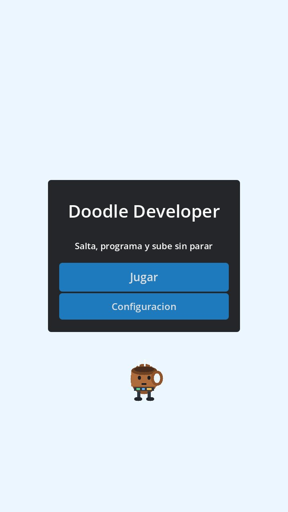
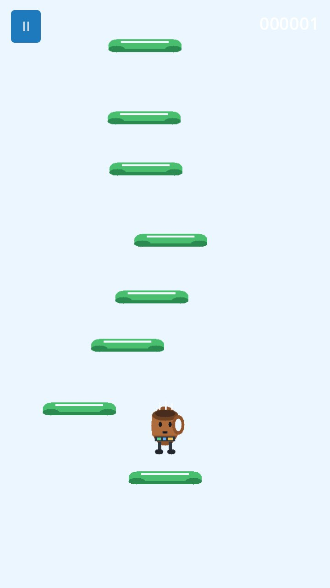
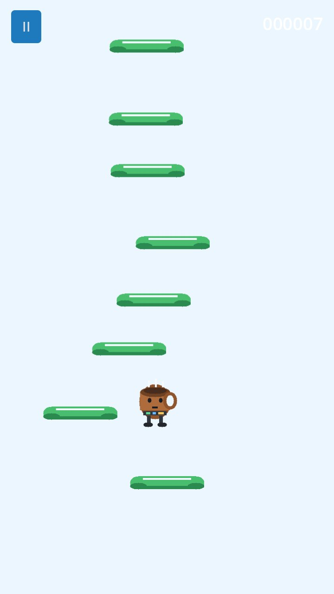
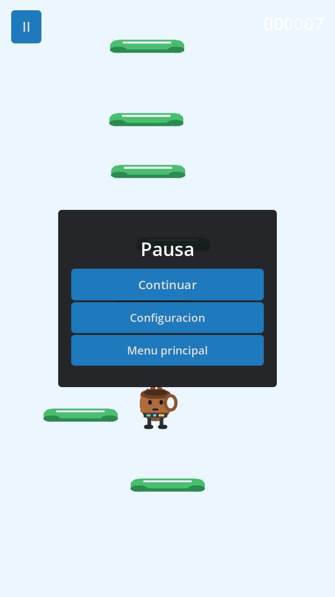
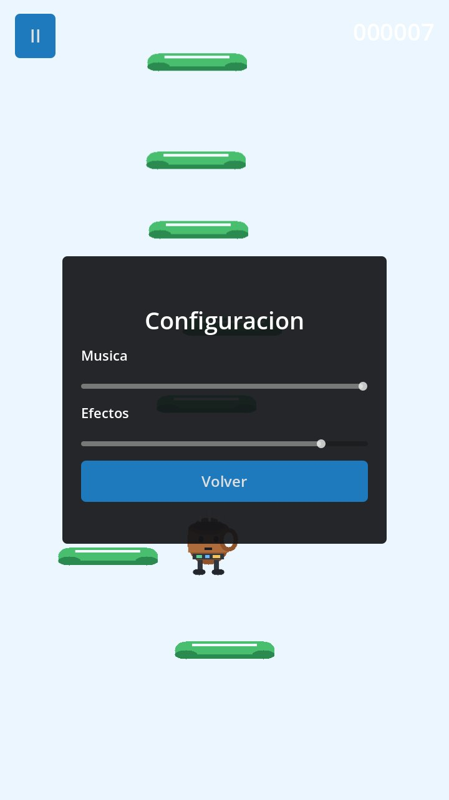
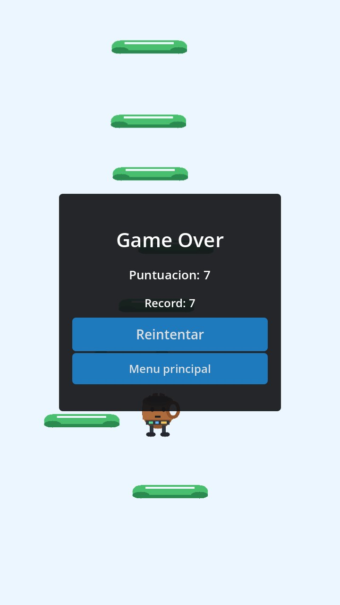

# Proceso de creación del videojuego Doodle Developer

## 1. Introducción

Este documento resume el proceso de creación del videojuego **Doodle Developer**, un prototipo móvil desarrollado con **Godot 4.6.2**. El juego toma como referencia la estructura jugable de Doodle Jump: el jugador salta de forma continua, aterriza sobre plataformas y la cámara asciende a medida que se alcanza mayor altura.

El objetivo principal del proyecto ha sido construir una base jugable para Android con controles táctiles, puntuación, pausa, configuración de audio, plataformas con comportamientos distintos y exportación inicial en formato APK Debug.

## 2. Configuración inicial del proyecto

- Motor utilizado: Godot 4.6.2.
- Plataforma objetivo inicial: Android.
- Orientación: vertical.
- Resolución base: 720 x 1280.
- Nombre de la aplicación: Doodle Developer.
- Paquete Android: com.doodledeveloper.game.
- Tipo de exportación inicial: APK Debug.

Desde el inicio se configuró el proyecto pensando en móviles. Se activó una resolución vertical, se preparó el preset de exportación Android y se generó un APK de prueba para validar que el proyecto podía instalarse fuera del editor.

## 3. Arquitectura general

La escena principal centraliza el flujo del juego:

- `Main.tscn`: escena principal, cámara, HUD, menús, audio y contenedor de plataformas.
- `Player.tscn`: jugador con física, animación visual y rebote.
- `Platform.tscn`: plataforma reutilizable con variantes normal, móvil y rompible.
- `Scripts/game.gd`: lógica general de partida, cámara, puntuación, spawn, pausa, ajustes y entrada táctil.
- `Scripts/player.gd`: movimiento horizontal, gravedad, rebote, envoltura lateral y animaciones del jugador.
- `Scripts/platform.gd`: comportamiento específico de cada plataforma.

Esta separación permite que el jugador, las plataformas y la lógica de partida evolucionen de forma independiente.

## 4. Mecánicas implementadas

El jugador salta automáticamente al aterrizar sobre una plataforma. La cámara sigue el progreso vertical y la puntuación aumenta según la altura máxima alcanzada. Si el jugador cae por debajo de la pantalla, se muestra el panel de Game Over.

Se añadieron tres tipos de plataforma:

- Plataforma normal: permite rebotar de forma estándar.
- Plataforma móvil: se desplaza lateralmente y cambia el ritmo del salto.
- Plataforma rompible: permite un rebote y después se rompe.

También se incluyeron sonidos distintos por tipo de plataforma para mejorar la respuesta del juego.

## 5. Mejora del control táctil

La primera aproximación usaba zonas táctiles invisibles a izquierda y derecha de la pantalla. Esta solución era sencilla, pero generaba una experiencia poco precisa: el jugador se movía por zona pulsada, no por intención real del dedo.

Después se sustituyó por una función de desplazamiento táctil. La mejora final consiste en seguir el **movimiento instantáneo del dedo**:

- Si el dedo se desliza hacia la izquierda, el jugador se mueve a la izquierda.
- Si el dedo se desliza más lento, el jugador reduce su velocidad.
- Si el dedo se para sin levantarlo, el jugador se para.
- Si el dedo cambia de sentido sin levantarlo, el jugador cambia de sentido.

Esta solución se ajusta mejor a controles móviles porque no obliga a mostrar botones en pantalla y permite que el personaje responda al ritmo real del dedo.

## 6. Explicación de los scripts principales

### `game.gd`

Este script controla el estado general de la partida. Gestiona el inicio del juego, el menú principal, la pausa, el Game Over, la puntuación, la cámara, la creación de plataformas y los ajustes de audio.

La parte táctil usa eventos de `InputEventScreenTouch` e `InputEventScreenDrag`. Cuando se detecta un dedo activo, el desplazamiento horizontal del evento (`relative.x`) se convierte en una dirección entre `-1` y `1`. Si dejan de llegar eventos de arrastre durante un pequeño intervalo, se interpreta que el dedo se ha parado y se pone la dirección táctil a `0`.

También recalcula el tamaño real del viewport para adaptar el juego a pantallas móviles con distintas proporciones.

### `player.gd`

Este script controla la física del jugador. En cada frame de física calcula la dirección horizontal, aplica gravedad, mueve el cuerpo con `move_and_slide()` y comprueba si ha aterrizado sobre una plataforma.

El movimiento horizontal puede venir del teclado durante pruebas en PC o del valor táctil calculado en `game.gd`. El jugador también se envuelve lateralmente: si sale por un lado de la pantalla, entra por el lado contrario.

Además incluye animaciones simples de squash and stretch para diferenciar salto, caída y rebote sobre plataforma.

### `platform.gd`

Este script define el comportamiento de las plataformas. Todas usan la misma escena base, pero cambian según su tipo: normal, móvil o rompible.

La plataforma móvil oscila lateralmente usando una onda senoidal. La plataforma rompible primero permite que el jugador rebote y después desactiva su colisión, reproduce una animación de caída/desvanecimiento y se elimina.

## 7. Pausa, configuración y audio

Se añadió un botón de pausa durante el gameplay. La pausa detiene la física, la cámara y los controles del jugador. Desde el panel de pausa se puede continuar, abrir la configuración o volver al menú principal.

El panel de configuración incluye dos controles:

- Volumen de música.
- Volumen de efectos.

Durante las pruebas se detectó que la música sonaba demasiado baja incluso al 100%. Se corrigió subiendo el volumen base de la música, manteniendo el slider para que el usuario pueda seguir ajustándolo.

## 8. Adaptación del viewport a móviles

En pruebas sobre móvil se detectó que el fondo quedaba fijo a 720 x 1280 y, en pantallas más altas, aparecía una franja gris fuera del área visual del juego.

La mejora aplicada consiste en usar el tamaño real del viewport del dispositivo:

- El fondo se ancla a pantalla completa.
- La cámara se centra usando el ancho real del dispositivo.
- El jugador usa el ancho real para la envoltura lateral.
- La generación y limpieza de plataformas usan la altura visible real.

Con esto el juego se adapta mejor a móviles con distintas proporciones de pantalla.

## 9. Game Over y récord

La pantalla de Game Over muestra la puntuación conseguida y el récord máximo de la sesión. También incluye botones para reintentar o volver al menú principal.

## 10. Exportación Android

Para preparar Android se siguieron estos pasos:

- Instalación de Android Studio.
- Configuración de SDK, JDK y debug keystore en Godot.
- Instalación de export templates de Godot 4.6.2.
- Creación del preset Android Debug.
- Configuración de paquete, versión y orientación vertical.
- Exportación del APK Debug.

El APK generado se encuentra en:

`builds/DoodleDeveloper-debug.apk`

## 11. Conclusión

El proyecto ya dispone de una base jugable completa para móvil: salto automático, plataformas infinitas, variantes de plataforma, HUD, pausa, Game Over, configuración de audio, sonidos, animación del jugador, viewport adaptado y exportación APK.

Las mejoras más importantes realizadas durante la iteración han sido la adaptación del viewport para dispositivos móviles y la sustitución de controles táctiles por movimiento según el deslizamiento del dedo, ya que afectan directamente a la experiencia real en Android.
